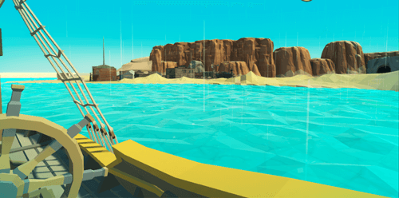
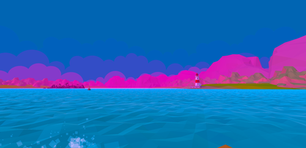
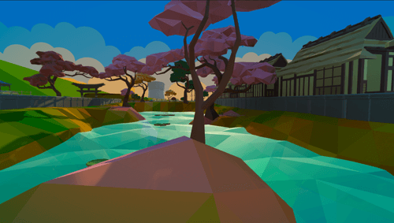
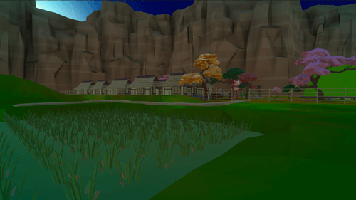

PC game (free) Open Beta out May 14th.

Explore the coasts. Buy low sell high to earn enough money to add items to your homestead or to buy more ships. Travel the seas with your armada.

## Features (on initial release)

* Offline mode.✅
* Buy and command fleet of merchant ships.✅
* Hire crew members.
* 3 types of merchants: vegetable, weapons and luxury.✅
* Eight explorable ports to purchase and sell goods.(6/8)
* Large open ocean.✅
* Day night cycle.✅
* Hunger, Thirst, Ship Health, Crew Health.

## Shortly After Initial Release:

1.  Traveled Map.
2.  Treasure Maps.
3.  Animated/Reflective Ocean.
4.  More Item Types.
5.  More Crew Members to Choose From.
6.  Homestead/Farm/Other Housing.
7.  Crafting/Harvesting.
8.  Diving/Ship Wrecks/Underwater Mining.
9.  Port Factions – attacking ships under x port’s flag will have consequences.
10. Reputation.
11. Player Pirate Ships/NPC Pirate and Merchant Ships/ Turn Based Combat
12. Leaderboards.
13. Multiplayer Auction House
14. Persistent Multiplayer World.
15. Multiplayer Ship Combat.
16. Terrestrial Player (and crew) VS World Combat.
17. Multiplayer Companies.
18. Expanded World.

## Screenshots

